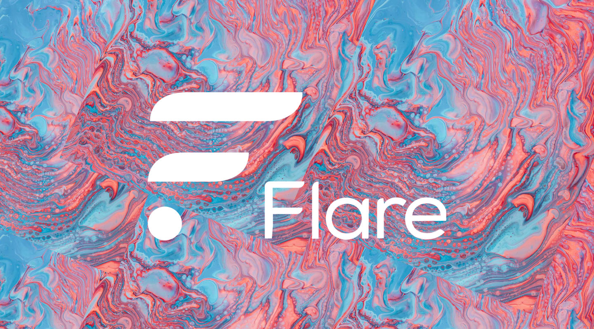
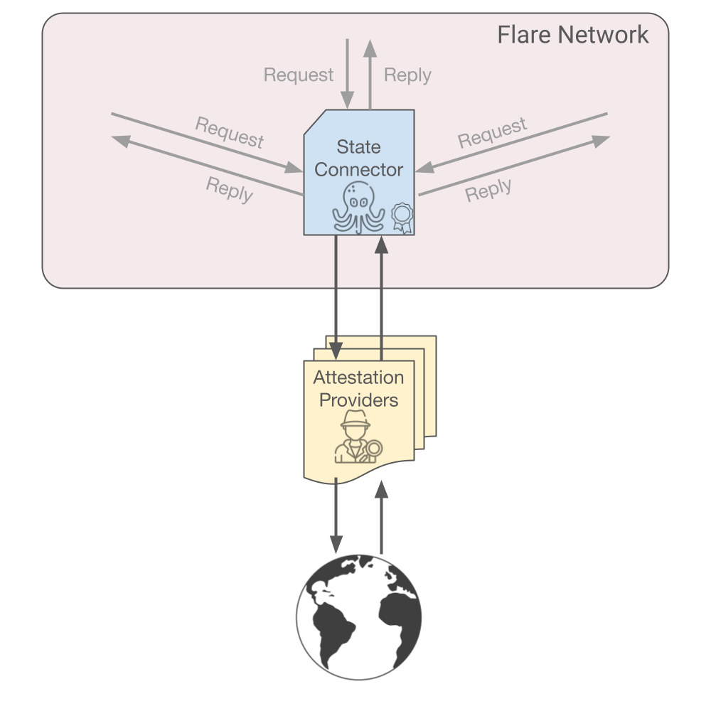
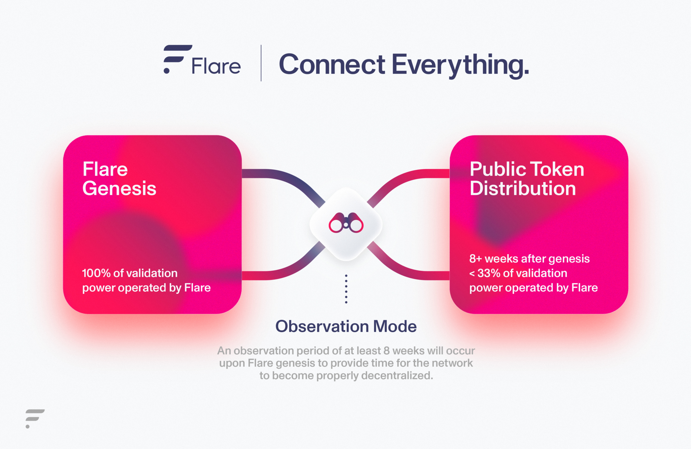
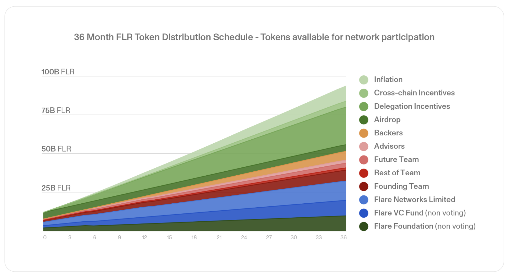
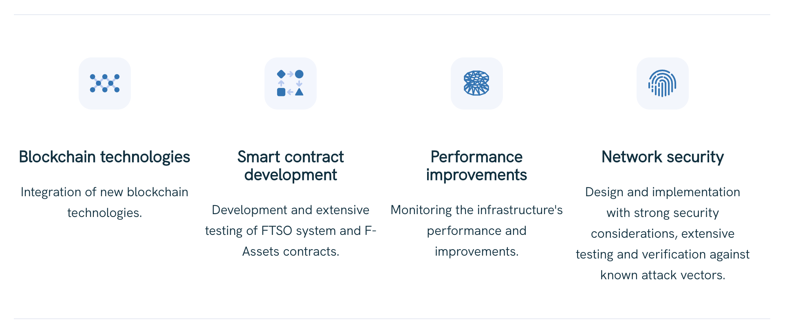

## **Flare Network: A Case Study**
 [[^1]](references/photo%201.html)
## <ins>**Overview and Origin**</ins>


* [**Flare Network**](references/Flare.Network.html) is a powerful new [**Layer 1**](references/Layer1.html) [**Blockchain**](references/Blockchain%20-%20Wikipedia.html) built to create applications for secure [**decentralised**](references/Decentralised%20system%20-%20Wikipedia.html) [**interoperability**](references/interoperability.html) with other [**Blockchains**](references/Blockchain%20-%20Wikipedia.html) & [**real world data sources**](references/Real-time%20data%20-%20Wikipedia.html).

* Flare Network integrates the [**Ethereum Virtual Machine (EVM)**](references/What%20is%20the%20Ethereum%20Virtual%20Machine%20(EVM)_%20_%20QuickNode%20_%20The%20Blockchain%20Development%20Platform%20-%20Guides.html) which enables the network to run [**Turing Complete Smart Contracts**](references/Turing%20Completeness%20and%20Smart%20Contract%20Security%20_%20by%20Taylor%20Rolfe%20_%20Kadena%20_%20Medium.html).

 [[^2]](references/Hugo%20Philion%20%E2%98%80%EF%B8%8F%20(@HugoPhilion)%20_%20Twitter.html)     [[^3]](references/(8)%20Sean%20Rowan%20_%20LinkedIn.html)

* Flare Network was founded in **2019** by [**Hugo Philion**](references/Hugo%20LinkedIn.html) (CEO) & [**Sean Rowan**](references/(8)%20Sean%20Rowan%20_%20LinkedIn.html) (CTO)

* In a video interview titled [**'The Flare Network: The Next Generation of Smart Contracts'**](references/The%20Flare%20Network_%20The%20Next%20Generation%20of%20Smart%20Contracts%20_%20Real%20Vision.html) [[^4]](references/The%20Flare%20Network_%20The%20Next%20Generation%20of%20Smart%20Contracts%20_%20Real%20Vision.html) published Jan 14, 2021 by [**Real Vision**](references/Real%20Vision%20Explains%20Finance,%20Business%20&%20The%20Global%20Economy.html), Hugo explains how the idea for the Flare Network came from leveraging security concepts utilized in [**XRP**](references/XRP%20price%20today,%20XRP%20to%20USD%20live%20marketcap%20and%20chart%20_%20CoinMarketCap.html) and frameworks from [**Ethereum**](references/Ethereum%20price%20today,%20ETH%20to%20USD%20live,%20marketcap%20and%20chart%20_%20CoinMarketCap.html) to create a [**Blockchain**](references/Blockchain%20-%20Wikipedia.html) that aims to be more secure and scalable by pulling the best pieces from existing [**crypto**](references/Cryptocurrency%20-%20Wikipedia.html) protocols.

* The most recent [**Crunchbase Report**](references/Flare%20Network%20-%20Crunchbase%20Company%20Profile%20&%20Funding.html) [[^5]](references/Flare%20Network%20-%20Crunchbase%20Company%20Profile%20&%20Funding.html) states that Flare Network has undergone three rounds of funding, raising a total of $11.3 million.

> 1. Initial Venture Round Nov 6, 2019
> 2. Second Venture Round Jun 8, 2021
> 3. Pre Seed Round Jul 29, 2021

[**'Flare Network Raises $11.3m in Funding Round With Kenetic and DCG'**](references/Flare%20Network%20Raises%20$11.3m%20in%20Funding%20Round%20With%20Kenetic%20and%20DCG%20-%20Decrypt.html) [[^6]](references/Flare%20Network%20Raises%20$11.3m%20in%20Funding%20Round%20With%20Kenetic%20and%20DCG%20-%20Decrypt.html) published Jun 8, 2021 by Stephen Graves for [**Decrypt**](references/Flare%20Network%20Raises%20$11.3m%20in%20Funding%20Round%20With%20Kenetic%20and%20DCG%20-%20Decrypt.html) states,

"[**Smart Contracts**](references/Smart%20contract%20-%20Wikipedia.html) platform Flare Network has raised $11.3 million in a funding round led by [**Kenetic Capital**](references/Kenetic%20Capital.html), with firms including [**Coinfund**](references/CoinFund.html) and [**Grayscale**](references/Grayscale%C2%AE%20_%20A%20Leader%20in%20Digital%20Currency%20Investing.html) parent company [**Digital Currency Group**](references/DCG.html) participating.

Other firms participating in the funding round include [**LD Capital**](references/LD%20Capital.html), [**cFund**](references/CFund%20%E2%80%93%20Funding%20the%20next%20generation%20of%20changemakers,%20innovators,%20and%20visionaries%20building%20on%20the%20blockchain..html), [**Wave Financial**](references/Wave%20Financial_%20Financial%20Software%20for%20Small%20Businesses.html), [**Borderless Capital**](references/Borderless%20Capital.html) & [**Backend Capital**](references/Backend%20Capital%20Homepage.html), while individuals taking part included [**Litecoin**](references/Litecoin%20price%20today,%20LTC%20to%20USD%20live,%20marketcap%20and%20chart%20_%20CoinMarketCap.html) founder [**Charlie Lee**](references/Charlie%20Lee%20%E2%93%82%EF%B8%8F%F0%9F%95%B8%EF%B8%8F%20(@SatoshiLite)%20_%20Twitter.html) & [**Terra**](references/Terra%20(blockchain)%20-%20Wikipedia.html) co-founder [**Do Kwon**](references/Do%20Kwon%20-%20Wikipedia.html)."

## <ins>**Business Activities**</ins>

[**'Flare Network: A Full Protocol Analysis'**](references/Flare%20Network_%20A%20Full%20Protocol%20Analysis.html) [[^7]](references/Flare%20Network_%20A%20Full%20Protocol%20Analysis.html) published Jan 13, 2022 to [**OxGregH's Substack**](references/Flare%20Network_%20A%20Full%20Protocol%20Analysis.html) states,

"Flare Network seek to solve two problems:

Non [**Turing Complete**](references/Turing%20completeness%20-%20Wikipedia.html) [**Blockchains**](references/Blockchain%20-%20Wikipedia.html) hold around 65% of the total value in [**crypto**](references/Cryptocurrency%20-%20Wikipedia.html).

[**Proof of Stake**](references/Proof%20of%20stake%20-%20Wikipedia.html) networks have some issues when it comes to security of the network.

Firstly, Flare's vision is to unlock the assets that are held in non-Turing complete chains.

[**Turing Completeness**](references/Turing%20Completeness%20and%20Smart%20Contract%20Security%20_%20by%20Taylor%20Rolfe%20_%20Kadena%20_%20Medium.html) is a key aspect of the chain design that enable [**smart contracts**](references/smart%20contracts.html) to exist. [**Smart Contracts**](references/Smart%20contract%20-%20Wikipedia.html) are required for the many functions that are needed to build useful [**dApps**](references/Decentralized%20application%20-%20Wikipedia.html).

Secondly, the team have identified issues with [**Proof of Stake**](references/Proof%20of%20stake%20-%20Wikipedia.html) due to the fact that [**PoS**](references/Proof%20of%20stake%20-%20Wikipedia.html) derive network safety from their [**native token**](references/NativeTokens.html)s.

In the short term this is an issue because if the [**staking yields**](references/Staking%20-%20Bitcoin%20Wiki.html) are less than that of a [**DeFi**](references/Decentralized%20finance%20-%20Wikipedia.html) protocol on the network the staker will likely divert tokens away from staking compromising the network’s security."

* Flare Network's intended customer is any business or organisation looking to create secure [**data bridges**](references/data%20bridge.html) between various [**Blockchains**](references/Blockchain%20-%20Wikipedia.html) & sources of [**real time data**](references/Real-time%20data%20-%20Wikipedia.html). This potential customer base is ever increasing, expanding & evolving as the [**Fintech**](references/Fintech%20-%20Wikipedia.html) domain continues to rapidly grow & innovate.

* Flare Network utilises the [**Ethereum Virtual Machine (EVM)**](references/What%20is%20the%20Ethereum%20Virtual%20Machine%20(EVM)_%20_%20QuickNode%20_%20The%20Blockchain%20Development%20Platform%20-%20Guides.html) which enables the network to run [**Turing complete smart contracts**](references/Turing%20Completeness%20and%20Smart%20Contract%20Security%20_%20by%20Taylor%20Rolfe%20_%20Kadena%20_%20Medium.html). But unlike other [**Blockchains**](references/Blockchain%20-%20Wikipedia.html) using [**EVM**](references/What%20is%20the%20Ethereum%20Virtual%20Machine%20(EVM)_%20_%20QuickNode%20_%20The%20Blockchain%20Development%20Platform%20-%20Guides.html), Flare Network have developed two unique mechanisms which set them apart from [**ALL**](references/coinmarketcap.html) other competing chains.

* [**'What is a layer 1 blockchain?'**](references/What%20is%20Layer%201%20Blockchain_%20_%20Bitstamp.html) [[^8]](references/What%20is%20Layer%201%20Blockchain_%20_%20Bitstamp.html) published Nov 30, 2022 by [**Bitstamp**](references/What%20is%20Layer%201%20Blockchain_%20_%20Bitstamp.html) states, 

"[**Layer 1**](references/Layer1.html) refers to a foundational [**Blockchain**](references/Blockchain%20-%20Wikipedia.html) on which blocks are produced, transactions are finalized, & a native [**cryptocurrency**](references/Cryptocurrency%20-%20Wikipedia.html) token is used to pay transaction fees and reward those who secure the network. The [**Blockchain Trilemma**](references/Trilemma.html) that [**L1**](references/Layer1.html) chains generally cannot accomplish [**decentralisation, security, & scalability**](references/Trilemma.html) all at once. Therefore, even by adjusting their architectures, there are significant limitations to [**L1**](references/Layer1.html).
Scaling solutions like [**layer 2**](references/layer2.html) solutions intend to resolve some of [**L1**](references/Layer1.html)’s inability to adapt to increased use."

This is where the unique capability of Flare Network really stands out. Flare Network has utilised [**L1**](references/Layer1.html) [**Blockchain Developer tools**](references/Complete%20List%20of%20Blockchain%20Development%20Tools%20You%20Need!.html) combined with multiple [**EVM Developer tools**](references/EVM%20Tools.html) to create one of the most powerfully advanced & capable [**L1**](references/Layer1.html) [**Blockchain**](references/Blockchain%20-%20Wikipedia.html) solutions the industry has seen, enabling lightning fast real time interoperability between multiple networks & data sources & enabling the contruction of [**Web3**](references/Web3%20-%20Wikipedia.html) interactive [**dApps**](references/Decentralized%20application%20-%20Wikipedia.html) which then enables even more utility for services to be built such as [**DeFi**](references/Decentralized%20finance%20-%20Wikipedia.html).


* [**"What Is Flare Network?"**](references/What%20Is%20Flare%20Network_%20_%20OKX.html) [[^9]](references/What%20Is%20Flare%20Network_%20_%20OKX.html) published Mar 16, 2023 by [**OKX Learn**](references/What%20Is%20Flare%20Network_%20_%20OKX.html) states, 

"Flare Network uses two interoperable protocols — the [**Flare Time Series Oracle**](references/FTSO%20-%20Technical%20Documentation.html) ([**FTSO**](references/FTSO%20-%20Technical%20Documentation.html)), & the [**State Connector**](references/State%20Connector%20-%20Technical%20Documentation.html). The [**State Connector**](references/State%20Connector%20-%20Technical%20Documentation.html) is used for consensus on data from external [**Blockchains**](references/Blockchain%20-%20Wikipedia.html) to be made on-chain, directly. As for the [**FTSO**](references/FTSO%20-%20Technical%20Documentation.html), it is a [**decentralised**](references/Decentralised%20system%20-%20Wikipedia.html) [**oracle**](references/oracle.html) that delivers off-chain data to the [**Blockchain**](references/Blockchain%20-%20Wikipedia.html)."

```
Flare Time Series Oracle (FTSO)
```
The Technical Documentation published for the [**FTSO**](references/FTSO%20-%20Technical%20Documentation.html) [[^10]](references/FTSO%20-%20Technical%20Documentation.html) on the Flare Network website states, 

"The [**Flare Time Series Oracle**](references/FTSO%20-%20Technical%20Documentation.html) ([**FTSO**](references/FTSO%20-%20Technical%20Documentation.html)) is a [**smart contract**](references/Smart%20contract%20-%20Wikipedia.html) running on the Flare network that provides continuous estimations for different types of data. It does so in a [**decentralised**](references/Decentralised%20system%20-%20Wikipedia.html) manner (no single party is in control of the process) and securely (it takes a lot of effort to disrupt the process).

To achieve a secure, [**decentralised system**](references/Decentralised%20system%20-%20Wikipedia.html), a set of independent data providers retrieves data from external sources, like [**centralised**](references/Centralized%20system%20definition%20and%20meaning%20_%20Collins%20English%20Dictionary.html) and [**decentralised exchanges**](references/DEX%20-%20Wiki%20_%20Golden.html), and supplies the data to the [**FTSO**](references/FTSO%20-%20Technical%20Documentation.html) system. Then, this information is weighted according to each provider's [**vote power**](references/Voting%20-%20Technical%20Documentation.html), & a median is calculated to produce the final estimate.

When [**FTSO**](references/FTSO%20-%20Technical%20Documentation.html)'s were initially designed, they supported only [**cryptocurrency price pairs**](references/price%20pairs.html). Now, they support all types of data. However, contract names & methods still refer to prices & [**price epochs**](references/Epoch%20_%20Alexandria.html).

[**Price pairs**](references/price%20pairs.html) are used in the following information to demonstrate how [**FTSO**](references/FTSO%20-%20Technical%20Documentation.html)'s work.

[**Data providers**](references/flaremetrics.html) that supply useful information, such as [**price pairs**](references/price%20pairs.html) that are not removed as outliers because they are too far away from the median value, are rewarded, and the resulting data estimates are finally published on-chain."

* The following diagram illustrates how [**price pairs**](references/price%20pairs.html) are submitted to & filtered by the [**FTSO**](references/FTSO%20-%20Technical%20Documentation.html) system.

 [[^10]](references/FTSO%20-%20Technical%20Documentation.html)

```
State Connector
```
The Technical Documentation published for the [**State Connector**](references/State%20Connector%20-%20Technical%20Documentation.html) [[^11]](references/State%20Connector%20-%20Technical%20Documentation.html) on the Flare Network website states,

"The [**State Connector**](references/State%20Connector%20-%20Technical%20Documentation.html) is a [**smart contract**](references/Smart%20contract%20-%20Wikipedia.html) running on the Flare network that allows anyone to query information from outside the Flare network. It does so in a [**decentralised**](references/Decentralised%20system%20-%20Wikipedia.html) manner (no single party is in control of the process) & securely (it takes a lot of effort to disrupt the process).

This is accomplished by using a set of independent [**attestation providers**](references/Attestation%20-%20Wikipedia.html) which fetch the required information from the world & deliver it to the Flare network. The [**State Connector**](references/State%20Connector%20-%20Technical%20Documentation.html) [**smart contract**](references/Smart%20contract%20-%20Wikipedia.html) then checks if there is enough consensus among the received answers & publishes the results if so.

As an added security measure, [**individual validators**](references/Validator%20Nodes%20-%20Technical%20Documentation.html) can also define local [**attestation providers**](references/Attestation%20-%20Wikipedia.html) which, when in disagreement with the rest, cause the validator to branch into an idle, safe state while the situation is resolved.

The [**State Connector**](references/State%20Connector%20-%20Technical%20Documentation.html) can, for instance, check whether a deposit has been made on another [**Blockchain**](references/Blockchain%20-%20Wikipedia.html), opening the door to much more advanced mechanisms."

* The following diagram illustrates the function of the [**State Connector**](references/State%20Connector%20-%20Technical%20Documentation.html).

 [[^11]](references/State%20Connector%20-%20Technical%20Documentation.html)

 [[^12]](references/F-Assets%20_%20The%20Flare%20Network.html)

 [[^13]](references/Flare%20price%20today,%20FLR%20to%20USD%20live,%20marketcap%20and%20chart%20_%20CoinMarketCap.html)

```
Flare Network Native Asset - FLR
```

[**Flare Network (FLR): A Layer -1 for Decentralized Data**](references/FLR.html) [[^14]](references/FLR.html) published Jan 8, 2023 by [**ByBit**](references/FLR.html) states,

"Flare Network's [**native token**](references/NativeTokens.html) is referred to as ([**FLR**](references/Flare%20price%20today,%20FLR%20to%20USD%20live,%20marketcap%20and%20chart%20_%20CoinMarketCap.html)). [**FLR**](references/Flare%20price%20today,%20FLR%20to%20USD%20live,%20marketcap%20and%20chart%20_%20CoinMarketCap.html) is created to maintain consistent usage costs, support the native data & interoperability protocols & facilitate a variety of use cases, including [**DeFi**](references/Decentralized%20finance%20-%20Wikipedia.html), [**NFT**](references/Non-fungible%20token%20-%20Wikipedia.html)s, [**Metaverse**](references/Metaverse%20-%20Wikipedia.html) and [**Web3**](references/Web3%20-%20Wikipedia.html) gaming. 

The primary purpose of [**FLR**](references/Flare%20price%20today,%20FLR%20to%20USD%20live,%20marketcap%20and%20chart%20_%20CoinMarketCap.html) is to prevent [**spam attacks via transaction fees**](references/Spam%20transactions%20-%20Bitcoin%20Wiki.html). After all, if transactions were completely free of charge, users would be able to spam & congest Flare Network with pointless transactions.

[**FLR**](references/Flare%20price%20today,%20FLR%20to%20USD%20live,%20marketcap%20and%20chart%20_%20CoinMarketCap.html) has several other uses besides spam control & payments within the Flare Network. When a user [**wraps**](references/Wrapping%20Flare%20Tokens%20-%20Technical%20Documentation.html) their [**FLR**](references/Flare%20price%20today,%20FLR%20to%20USD%20live,%20marketcap%20and%20chart%20_%20CoinMarketCap.html) into [**WFLR**](references/Wrapping%20Flare%20Tokens%20-%20Technical%20Documentation.html), it achieves more programmable functions like the ability to act as collateral in [**dApps**](references/Decentralized%20application%20-%20Wikipedia.html), [**delegation**](references/Managing%20Delegations%20-%20Technical%20Documentation.html) to the [**FTSO**](references/FTSO%20-%20Technical%20Documentation.html) to support the delivery of [**decentralised**](references/Decentralised%20system%20-%20Wikipedia.html) data to the network & participation in [**governance**](references/Voting%20-%20Technical%20Documentation.html).

Flare Network was set to be launched in phases. After over two years of development, Flare Network launched on Jul 13, 2022 as a soft beta on a private [**observation mode**](references/Flare%20Launch%20Process%20-%20Technical%20Documentation.html).

By Sep 30, Flare Network had commenced its public [**observation mode**](references/Flare%20Launch%20Process%20-%20Technical%20Documentation.html)."

 [[^15]](references/connect%20image.html)

Of the 100 billion genesis [**FLR**](references/Flare%20price%20today,%20FLR%20to%20USD%20live,%20marketcap%20and%20chart%20_%20CoinMarketCap.html) tokens, 58.3%, or 58.3 billion [**FLR**](references/Flare%20price%20today,%20FLR%20to%20USD%20live,%20marketcap%20and%20chart%20_%20CoinMarketCap.html), are set aside for the community, with 28.5 billion of the 58.3% allocated to the direct [**public token distribution**](references/distribution.html), also known as the [**FlareDrop Distribution**](references/Flaredrop%20-%20Technical%20Documentation.html). 

The first 15% of these public tokens, or 4.3 billion [**FLR**](references/Flare%20price%20today,%20FLR%20to%20USD%20live,%20marketcap%20and%20chart%20_%20CoinMarketCap.html), were successfully distributed on Jan 9, 2023 to wallets that held [**XRP**](references/XRP%20price%20today,%20XRP%20to%20USD%20live,%20marketcap%20and%20chart%20_%20CoinMarketCap.html) during a [**snapshot**](references/snapshot.html) completed in December 2020. The remaining 85%, or 24.2 billion [**FLR**](references/Flare%20price%20today,%20FLR%20to%20USD%20live,%20marketcap%20and%20chart%20_%20CoinMarketCap.html), will be made available on-chain, in a [**decentralised**](references/Decentralised%20system%20-%20Wikipedia.html) manner, to all wallets that hold [**Wrapped Flare**](references/Wrapping%20Flare%20Tokens%20-%20Technical%20Documentation.html) ([**WFLR**](references/Wrapping%20Flare%20Tokens%20-%20Technical%20Documentation.html)). Almost 700 million [**FLR**](references/Flare%20price%20today,%20FLR%20to%20USD%20live,%20marketcap%20and%20chart%20_%20CoinMarketCap.html) will be proportionally shared by [**WFLR**](references/Wrapping%20Flare%20Tokens%20-%20Technical%20Documentation.html) holders every 30 days for a total of 36 installments. [[^14]](references/FLR.html)

 [[^14]](references/FLR.html)

The [**airdrop**](references/Airdrop%20(cryptocurrency)%20-%20Wikipedia.html) is slowly being rolled out to ensure that users don't instantly sell all of their [**FLR**](references/Flare%20price%20today,%20FLR%20to%20USD%20live,%20marketcap%20and%20chart%20_%20CoinMarketCap.html) tokens after receiving them (which would likely lead to a massive price drop).

While many [**XRP**](references/XRP%20price%20today,%20XRP%20to%20USD%20live,%20marketcap%20and%20chart%20_%20CoinMarketCap.html) owners are interested in using Flare Network because of the utility created by these tokens, a small percentage of individuals are only looking to claim [**FLR**](references/Flare%20price%20today,%20FLR%20to%20USD%20live,%20marketcap%20and%20chart%20_%20CoinMarketCap.html) because it’s essentially 'free money'. Another step that’s been taken to mitigate the potential for adverse effects from the [**airdrop**](references/Airdrop%20(cryptocurrency)%20-%20Wikipedia.html) involves limiting the amount of [**liquidity**](references/liquidity%20-%20Wikipedia.html) available on the market at any given time. The lengthy unlock process naturally reduces total [**liquidity**](references/liquidity%20-%20Wikipedia.html).

To ensure that glitches and other technical issues are kept to a minimum during the Flare Network launch, the reputable firm known as [**Trail of Bits**](references/Trail%20of%20Bits.html) performed a comprehensive audit, which began on May 16, 2022 & ended after the first week of June. On Jun 16, the results of the audit were announced. The audit found no significant defects or flaws that could negatively impact the network, allowing for a full launch on Jul 13, 2022.

[**FLR**](references/Flare%20price%20today,%20FLR%20to%20USD%20live,%20marketcap%20and%20chart%20_%20CoinMarketCap.html) was released in the markets on Jan 10, 2023 at $0.04. [**FLR**](references/Flare%20price%20today,%20FLR%20to%20USD%20live,%20marketcap%20and%20chart%20_%20CoinMarketCap.html) is considered to be an [**inflationary token**](references/Inflationary%20vs.%20Deflationary%20Cryptocurrencies-%20Key%20Differences%20-%20101%20Blockchains.html) as the [**FTSO**](references/FTSO%20-%20Technical%20Documentation.html) will pay out any newly minted [**FLR**](references/Flare%20price%20today,%20FLR%20to%20USD%20live,%20marketcap%20and%20chart%20_%20CoinMarketCap.html) tokens. Based on its original token distribution plan, the annual inflation is set at 10% each year of all FLR tokens.

However, Flare initiated a [**governance proposal**](references/Voting%20-%20Technical%20Documentation.html) regarding its token distribution, the [**FIP.01 proposal**](references/Voting%20-%20Technical%20Documentation.html), to reduce both short-term and long-term inflation. Now the proposal has passed, the inflation will be adjusted to 10% of circulating supply in year 1, 7% in year 2, & 5% in year 3 onward, capped at 5 billion [**FLR**](references/Flare%20price%20today,%20FLR%20to%20USD%20live,%20marketcap%20and%20chart%20_%20CoinMarketCap.html) tokens per year. 70% of the tokens are allocated to its [**FTSO**](references/FTSO%20-%20Technical%20Documentation.html) rewards, 20% to its validator rewards, & 10% to the default [**Attestation Provider**](references/Attestation%20-%20Wikipedia.html) set of the [**State Connector**](references/State%20Connector%20-%20Technical%20Documentation.html). [[^14]](references/FLR.html)

 [[^14]](references/FLR.html)

## <ins>**Landscape**</ins>

* Flare Network is providing a service to facilitate utility driven innovation in the [**Blockchain**](references/Blockchain%20-%20Wikipedia.html) & [**Cryptocurrency**](references/Cryptocurrency%20-%20Wikipedia.html) domain.

* [**'The Decade in Blockchain — 2010 to 2020 in Review'**](references/The%20Decade%20in%20Blockchain%20%E2%80%94%202010%20to%202020%20in%20Review%20_%20ConsenSys.html) [[^15]](references/The%20Decade%20in%20Blockchain%20%E2%80%94%202010%20to%202020%20in%20Review%20_%20ConsenSys.html) published Dec 3,2019 by ConsenSys Provides a detailed timeline of every significant event that has occured in the domain from 2010 - 2020.

Since 2020 we have seen two major developments in the domain.

The introduction & explosion of [**DeFi**](references/Decentralized%20finance%20-%20Wikipedia.html) & [**NFT**](references/Non-fungible%20token%20-%20Wikipedia.html)'s

The evolution of [**Smart Contracts**](references/Smart%20contract%20-%20Wikipedia.html) is the main factor driving this development.
This enables [**Web3**](references/Web3%20-%20Wikipedia.html) application developers to design & build innovative solutions that are interoperable across the whole economy.

* Other major companies in the [**Blockchain**](references/Blockchain%20-%20Wikipedia.html) & [**Cryptocurrency**](references/Cryptocurrency%20-%20Wikipedia.html) domain who are also providing a suite of innovative solutions include [**Ripple**](references/Ripple.html), [**Stellar Development Foundation**](references/Stellar%20Development%20Foundation%20-%20Stellar.html), [**Algorand Foundation**](references/Algorand%20Foundation.html), [**The HBAR Foundation**](references/The%20HBAR%20Foundation.html), [**XinFin Foundation**](references/XinFin.html), [**Vechain**](references/Vechain%20_%20Blockchain%20for%20Our%20Better%20World.html), [**Casper Labs**](references/Casper%20Labs%20_%20Home.html) & [**Chainlink Labs**](references/Chainlink%20Labs.html)

  [[^16]](references/AbeliumFlare.html)

## <ins>**Results**</ins>

* Flare Network officially launched in [**observation mode**](references/Flare%20Launch%20Process%20-%20Technical%20Documentation.html) on July 13, 2022 & is still in its infancy & currently in the process of distributing the network [**native token**](references/NativeTokens.html) [**FLR**](references/Flare%20price%20today,%20FLR%20to%20USD%20live,%20marketcap%20and%20chart%20_%20CoinMarketCap.html), yet in the 3 years since its founding Flare Network has gained a large community of developers & [**FTSO**](references/FTSO%20-%20Technical%20Documentation.html) providers who are utilising the network & a large world-wide community of traders & holders of its [**native token**](references/NativeTokens.html) [**FLR**](references/Flare%20price%20today,%20FLR%20to%20USD%20live,%20marketcap%20and%20chart%20_%20CoinMarketCap.html) which provides the user the ability to buy, hold, trade & earn various streams of passive income by interacting with the network in [**DeFi**](references/Decentralized%20finance%20-%20Wikipedia.html) ecosystems via the use of [**dApps**](references/Decentralized%20application%20-%20Wikipedia.html). Flare Network has been embraced by the [**Blockchain**](references/Blockchain%20-%20Wikipedia.html) & [**Cryptocurrency**](references/Cryptocurrency%20-%20Wikipedia.html) domain & is positioned to capitalise on the [**United Nations Sustainability Goals**](references/SDGs.html) & the global need for innovative financial solutions to facilitate them.

* Some of the core metrics that companies in this domain use to measure success include **grants awarded to developers & the number of companies using the protocol by building on or utilising the network**. Some other core metrics used to measure the success of an [**L1**](references/Layer1.html) [**Blockchain**](references/Blockchain%20-%20Wikipedia.html) are,


> - Total Transactions Processed
> - Total Blocks Processed
> - Average Block Time
> - Wallet Addresses
> - Down Time


Flare Network currently has [**over 60 FTSO providers**](references/flaremetrics.html) listed on [**Flaremetrics**](references/flaremetrics.html) & the [**network explorer tool**](references/Flare%20Explorer.html) [**Flare Explorer**](references/Flare%20Explorer.html) shows the network has [**processed over 20,000,000 transactions**](references/Flare%20Explorer.html), [**over 6,400,000 total blocks**](references/Flare%20Explorer.html), at [**an average block time of 2 seconds**](references/Flare%20Explorer.html), the network now has [**over 305,000 wallets**](references/Flare%20Explorer.html) with [**ZERO down time**](references/Flare%20Explorer.html). The company is performing extremely well relative to its competitors especially in the current bear market environment, this is due to the large world-wide community that has been enthusiastically researching, supporting & participating in the network from its inception. Based on these metrics Flare Network appears to be having an explosive start.

The future is looking extremely bright for the [**Flare Network.**](references/Flare.Network.html)

[**#ConnectEverything**](references/Flare.Network.html)

  [[^17]](references/connect%20image.html)

## <ins>**Recommendations**</ins>

* If I were to advise the Flare Network I would suggest they utilise their talented team of developers to design a user-friendly, interactive [**dApp**](references/Decentralized%20application%20-%20Wikipedia.html) development platform, housing a series of customisable [**DeFi**](references/Decentralized%20finance%20-%20Wikipedia.html) ecosystem templates as a tool that can be utilised by Flare Network to demonstrate the many use cases & potential possibilities of building on the Flare Network.

* This offering would capitalise on the growing trend of [**Digital Banking**](references/Digital%20banking%20-%20Wikipedia.html) & greatly benefit Flare Network by providing multiple real world examples of how the technology can be utilised to create innovative solutions while simultaneously significantly lowering the barrier to entry for businesses & developers by increasing overall user-friendliness.

* This service would require the Flare Network to utilise their [**Blockchain Developer**](references/10%20Most%20Popular%20Blockchain%20Tools%20In%202023%20-%20Naukri%20Learning.html) & [**EVM Tools**](references/EVM%20Tools.html) as well as [**Web Development Tools**](references/webdevtools.html).

* User-friendliness is key when it comes to adoption of new technologies. Although creating a suite of interactive customisable [**Defi**](references/Decentralized%20finance%20-%20Wikipedia.html) ecosystem templates may not require a quantum leap in innovation, it does however provide Flare Network with an incredible tool that could give them a competitive edge that will dramatically increase the awareness of & interaction with Flare Network, not only within the [**Fintech**](references/Fintech%20-%20Wikipedia.html) domain but the general population.

 [[^18]](references/dopelogo.html)


#### <ins>**Bibliography**</ins>

[[^1]:](references/photo%201.html) Image - [**abelium.com/en/case/Flare/**](references/AbeliumFlare.html)

[[^2]:](references/Hugo%20Philion%20%E2%98%80%EF%B8%8F%20(@HugoPhilion)%20_%20Twitter.html) Image - [**twitter.com/HugoPhilion**](references/Hugo%20Philion%20%E2%98%80%EF%B8%8F%20(@HugoPhilion)%20_%20Twitter.html)

[[^3]:](references/(8)%20Sean%20Rowan%20_%20LinkedIn.html) Image - [**linkedin.com/in/sprwn/**](references/(8)%20Sean%20Rowan%20_%20LinkedIn.html)

[[^4]:](references/The%20Flare%20Network_%20The%20Next%20Generation%20of%20Smart%20Contracts%20_%20Real%20Vision.html) **'The Flare Network: The Next Generation of Smart Contracts'** - [**realvision.com/shows/cryptoverse/videos/the-flare-network-the-next-generation-of-smart-contracts-ejxV?tab=details**](references/The%20Flare%20Network_%20The%20Next%20Generation%20of%20Smart%20Contracts%20_%20Real%20Vision.html)

[[^5]:](references/Flare%20Network%20-%20Crunchbase%20Company%20Profile%20&%20Funding.html) **Crunchbase Report** - [**crunchbase.com/organization/flare-networks-417a**](references/Flare%20Network%20-%20Crunchbase%20Company%20Profile%20&%20Funding.html)

[[^6]:](references/Flare%20Network%20Raises%20$11.3m%20in%20Funding%20Round%20With%20Kenetic%20and%20DCG%20-%20Decrypt.html) **'Flare Network Raises $11.3m in Funding Round With Kenetic and DCG'** - [**decrypt.co/73008/flare-network-raises-11-3m-in-funding-round-with-kenetic-dcg**](references/Flare%20Network%20Raises%20$11.3m%20in%20Funding%20Round%20With%20Kenetic%20and%20DCG%20-%20Decrypt.html)

[[^7]:](references/Flare%20Network_%20A%20Full%20Protocol%20Analysis.html) **'Flare Network: A Full Protocol Analysis'** - [**0xgregh.substack.com/p/flare-network-a-full-protocol-analysis**](references/Flare%20Network_%20A%20Full%20Protocol%20Analysis.html)

[[^8]:](references/What%20is%20Layer%201%20Blockchain_%20_%20Bitstamp.html) **'What is a layer 1 blockchain?'** - [**bitstamp.net/learn/blockchain/what-is-a-layer-1-blockchain/**](references/What%20is%20Layer%201%20Blockchain_%20_%20Bitstamp.html)

[[^9]:](references/What%20Is%20Flare%20Network_%20_%20OKX.html) **'What Is Flare Network?'** - [**okx.com/learn/what-is-flare-network**](references/What%20Is%20Flare%20Network_%20_%20OKX.html)

[[^10]:](references/FTSO%20-%20Technical%20Documentation.html) **Flare Time Series Oracle Technical Documentation** - [**docs.flare.network/tech/ftso/**](references/FTSO%20-%20Technical%20Documentation.html)

[[^11]:](references/State%20Connector%20-%20Technical%20Documentation.html) **State Connector Technical Documentation** - [**docs.flare.network/tech/state-connector/**](references/State%20Connector%20-%20Technical%20Documentation.html)

[[^12]:](references/F-Assets%20_%20The%20Flare%20Network.html) **Image** - [**alphaoracle.io/flare-network/f-assets/**](references/F-Assets%20_%20The%20Flare%20Network.html)

[[^13]:](references/Flare%20price%20today,%20FLR%20to%20USD%20live,%20marketcap%20and%20chart%20_%20CoinMarketCap.html) **Image** - [**coinmarketcap.com/currencies/flare/**](references/Flare%20price%20today,%20FLR%20to%20USD%20live,%20marketcap%20and%20chart%20_%20CoinMarketCap.html)

[[^14]:](references/FLR.html) **'Flare Network (FLR): A Layer -1 for Decentralized Data'** - [**learn.bybit.com/defi/what-is-flare-network-flr-spark/**](references/FLR.html)

[[^15]:](references/The%20Decade%20in%20Blockchain%20%E2%80%94%202010%20to%202020%20in%20Review%20_%20ConsenSys.html) **'The Decade in Blockchain — 2010 to 2020 in Review'** - [**consensys.net/blog/news/the-decade-in-blockchain-2010-to-2020-in-review/**](references/The%20Decade%20in%20Blockchain%20%E2%80%94%202010%20to%202020%20in%20Review%20_%20ConsenSys.html)

[[^16]:](references/AbeliumFlare.html) **Image** - [**abelium.com/en/case/Flare/**](references/AbeliumFlare.html)

[[^17]:](references/ConnectImage1.html) Image - [**docs.pangolin.exchange/multichain/flare-network**](references/ConnectImage1.html)

[[^18]:](references/F-Assets%20_%20The%20Flare%20Network.html) **Image** - [**alphaoracle.io/flare-network/f-assets/**](references/F-Assets%20_%20The%20Flare%20Network.html)


